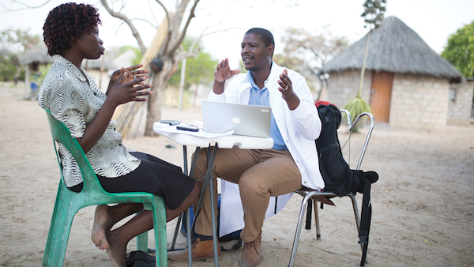

History
=======

The system was first piloted in 2010 for a small trial in Mochudi, Botswana after an attempt to administer the trial on paper imploded within six weeks. We developed the original core from scratch on the Django framework (v1.9). For it to meet the workflow needs of the trial, we added functionality for asynchronous data collection. Later in 2013 we received significant funding through the `Botswana Combination Prevention Project (BCPP) <https://data.cdc.gov/Global-Health/Botswana-Combination-Prevention-Project-BCPP-Publi/qcw5-4m9q/about_data>`_ and further developed the system to manage the data for this complex trial conducted over 4 years across 30 remote villages in Botswana. During this period the core modules (edc-) matured and were generalized for use across multiple multisite longitudinal randomized trials in Botswana conducted during the same period.

Our philosophy is that an "EDC" should be customized to meet the complex needs of a trial, embed the strict study procedures, quality assurance, and regulatory compliance into its workflow -- and be easy to use! We have kept this in mind as we resist over generalizing modules. For example, the BCPP project research assistants collected data on their participants in very remote and challenging conditions. As was said back in 2016, "Our RAs have to be good at dealing with people-talking to them about the importance of knowing their HIV status or participating in the study. If we find someone who's good at counseling and dealing with people, we'll make sure that person -- as long as they've got enough fingers to hit the keyboard -- can operate the system."

   Field team at work in Shakawe, Botswana in 2016

We also believe in capacity building. The clinical trials domain is a great place to learn how to program and deploy complex and critical data systems. Over the years, scores of young people in Botswana, South Africa, Uganda and Tanzania have started their programming and data management careers developing their skills building EDC systems for clinical trials using this framework.

The codebase continues to evolve over the many years of conducting clinical trials for mostly NIH-funded clinical trials through
the `Harvard T Chan School of Public Health <https://aids.harvard.edu>`__, the
`Botswana-Harvard AIDS Institute Partnership <https://aids.harvard.edu/research/bhp>`__
in Gaborone, Botswana and the `London School of Hygiene and Tropical Medicine <https://lshtm.ac.uk>`__.
Almost all trials were originally related to HIV/AIDS research.

More recent work with the `RESPOND Africa Group <https://www.ucl.ac.uk/global-health/respond-africa>`__ formerly at the
`Liverpool School of Tropical Medicine <https://lstm.ac.uk>`__ and now with the `University College London Institute for Global Health <https://www.ucl.ac.uk/global-health/>`__ has expanded into Diabetes (DM),
Hypertension (HTN) and models of integrating care in Africa (https://inteafrica.org) for the
three main chronic conditions -- HIV/DM/HTN.

See also https://www.ucl.ac.uk/global-health/respond-africa

The implementations we now develop with this framework are mostly eSource systems, rather than the traditional EDCs, deployed as cloud-based systems.
